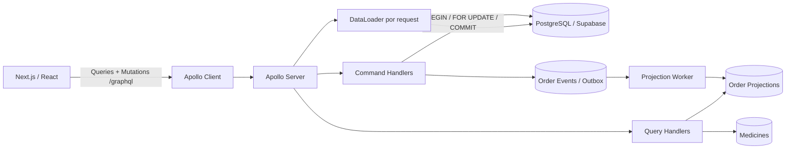

# Arquitectura de Afirmative Pill



## CQRS

- **Write model:** `orders`, `order_items`, `prescriptions`, inventario en `medicines` y `order_events`.
- **Commands:** `createOrder`, `validatePrescription`, `dispatchOrder`, `cancelOrder`.
- **Read model:** `order_projections`, denormalizado para la pantalla de seguimiento.
- **Queries:** catálogo/detalle de medicamentos y consulta de proyección del pedido.

El comando `createOrder` bloquea las filas de medicamentos con `SELECT ... FOR UPDATE`, valida stock y soporte de fórmula, descuenta inventario y crea la orden dentro de una única transacción.

## Consistencia eventual

En Docker, el servicio `projector` consume la tabla outbox `order_events` y actualiza `order_projections`. La UI hace polling corto para que el estado `PENDING_APPROVAL` sea visible mientras la proyección converge.

En despliegues serverless como Vercel se recomienda `PROJECTION_MODE=inline`: el lado Query procesa eventos pendientes de la orden antes de leer su proyección. Mantiene la separación CQRS sin requerir un proceso residente.

## N+1

Los campos anidados `Medicine.category` y `Medicine.laboratory` se resuelven con DataLoader. Cada request GraphQL crea loaders nuevos; los IDs se agrupan en una consulta `WHERE id = ANY($1)` y se cachean solo durante ese request.

Los logs tienen el formato:

```text
[DataLoader] laboratories batch ids=[...]
[DataLoader] categories batch ids=[...]
```

Esto permite mostrar en sustentación que una consulta de 50 medicamentos no produce 50 consultas de laboratorio/categoría.
